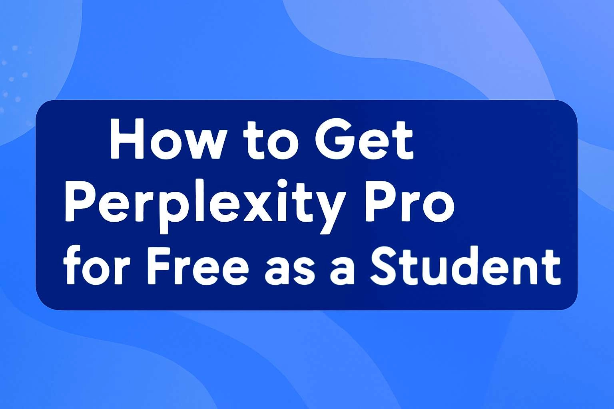

# 学生党福利：Perplexity Pro免费使用完全指南

---

作为学生党，每个月的订阅费用都是笔不小的开支。但如果告诉你，有办法免费用上Perplexity Pro这样的顶级AI工具，你会不会心动？

这篇文章就是要告诉你：怎么以学生身份，合理合法地免费解锁Perplexity Pro的全部功能。不是什么破解教程，而是官方认可的正规途径。看完你就知道，省钱和用好工具，完全可以兼得。

---



## 方法一：谷歌云学生试用通道

谷歌云给新用户准备了300美元的免费额度。听起来是不是很慷慨？关键是，这笔钱可以用来调用Perplexity Pro的API接口。

具体怎么操作？很简单：

1. 打开谷歌云官网注册账号
2. 填写信用卡信息（别担心，试用期不会扣费）
3. 进入控制台找到Vertex AI板块
4. 启用Perplexity Pro API
5. 开始调用接口生成内容

API调用的端点长这样：

```
https://us-central1-aiplatform.googleapis.com/v1/projects/YOUR_PROJECT_ID/locations/us-central1/publishers/google/models/perplexity-3.0-generate-preview:predict
```

这个方法的好处是，300美元额度够你用挺长时间。如果只是做作业、写论文、搞点小研究，基本不用担心用超。

想了解更多技术细节，可以翻翻谷歌的Vertex AI文档。那里有完整的API调用指南。

## 方法二：.edu邮箱直通车

如果你有学校发的.edu邮箱，那就更简单了。直接通过教育计划申请Perplexity Pro权限。

获取.edu邮箱的路径：
- 注册认证院校（美国大学基本都发.edu邮箱）
- 拿到邮箱后加入谷歌AI教育计划
- 解锁Pro功能，开始使用

这种方法最省心。不用折腾API，不用担心额度用完。只要你的学生身份还在，权限就一直有效。

想要稳定使用Perplexity Pro，除了免费账号，其实还可以考虑直接购买成品号。👉 [Perplexity Pro年费成品号，省去申请麻烦，24小时自动发货，365天质保服务！](https://shaoyumi.com/buy/64) 特别适合需要长期稳定使用、不想折腾申请流程的同学。

## 搭配VPS让效率翻倍

免费账号到手只是第一步。如果你要处理大量内容、跑复杂项目，还需要一台靠谱的服务器支持。

这时候LightNode VPS就派上用场了。它能帮你：

- **加速内容生成**：高性能CPU + NVMe固态硬盘
- **降低网络延迟**：全球多个数据中心可选
- **弹性调整配置**：按需增减资源
- **只为用量付费**：小时计费，用多少算多少

配置步骤也不复杂：

1. 注册LightNode选套餐（新手推荐2GB内存配置）
2. 选个靠近谷歌云的数据中心
3. 装上Python环境
4. SSH连接服务器
5. 开始调用API

Python安装命令：
```bash
sudo apt update
sudo apt install python3 python3-pip
```

SSH连接命令：
```bash
ssh user@your_lightnode_vps_ip
```

API调用示例：
```bash
curl -X POST https://us-central1-aiplatform.googleapis.com/v1/projects/YOUR_PROJECT_ID/locations/us-central1/publishers/google/models/perplexity-3.0-generate-preview:predict \
-H "Content-Type: application/json" \
-d '{
  "instances": [{"input": "生成AI研究趋势摘要"}],
  "params": {"temperature": 0.7}
}'
```

整个流程跑通之后，你就能体验到什么叫"丝般顺滑"的AI内容生成了。

## 常见疑问解答

**Perplexity Pro真的免费吗？**

不完全免费。但谷歌云的300美元试用额度和教育计划，基本能让学生零成本使用相当长时间。

**Perplexity 2和3有什么不同？**

3代模型更聪明，生成质量更高，和谷歌云的集成也更深入。如果能用3代，就别用2代。

**什么是Perplexity Pro？**

谷歌开发的AI内容生成工具。你给它文本或图片提示，它就能生成高质量内容。适合写作业、做研究、搞创作。

试用期或教育计划能体验大部分功能。想要持续用完整版，通常需要付费。不过对学生来说，免费通道已经够用了。

---

## 写在最后

通过谷歌云试用或教育通道，配合VPS的算力支持，学生党完全可以免费用上Perplexity Pro这样的顶级AI工具。

如果你想省去申请和配置的繁琐流程，直接获得稳定可用的账号，👉 [Perplexity Pro年费成品号](https://shaoyumi.com/buy/64)是个不错的选择——自动发货，一年质保，省心省力。

有问题随时问，技术支持随时在线。
